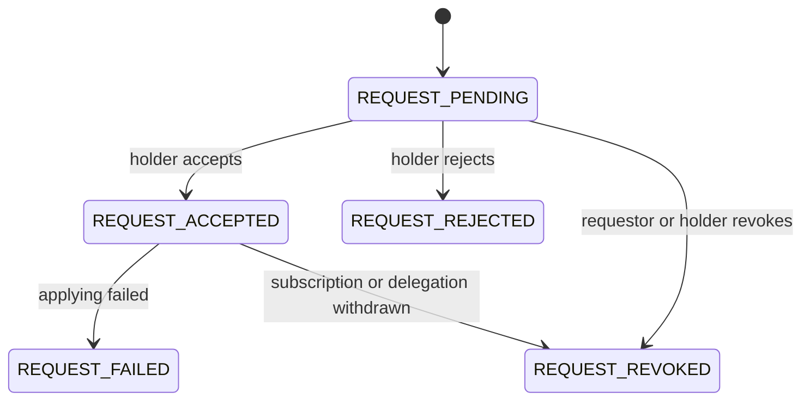

# Action requests

A partner never changes your data directly. It asks: a `PATCH` with an
`api:Change` becomes a `ChangeRequest`, a `POST /subscriptions` a
`SubscriptionRequest`, a `POST /access-delegations` an
`AccessDelegationRequest`, a `POST /logistics-objects/{id}` with an
`api:Verification` a `VerificationRequest`. Each is an `api:ActionRequest`
with a URI under `/action-requests/`, a status and a history, and the holder
decides it.

## Lifecycle

Verification requests have their own, shorter machine: pending to
`REQUEST_ACKNOWLEDGED`, `REQUEST_REJECTED` or `REQUEST_REVOKED`.

A change request cannot be revoked once accepted: the revision exists. A
subscription or access delegation can, and revoking it stops notifications
or withdraws the grants.

## Deciding

Over HTTP, the holder's systems call `PATCH /action-requests/{id}?status=REQUEST_ACCEPTED`
(or `REQUEST_REJECTED`, `REQUEST_ACKNOWLEDGED`, `REQUEST_REVOKED`), answered
204. The spec marks this endpoint internal, so the access policy must allow
`Action::DecideActionRequest` for the caller; partners get 403.

In PHP, `DataHolder::accept($iri)`, `reject($iri, $errors)`, `acknowledge($iri)`
and `revoke($iri)` do the same. Rejections carry `api:Error`s the requestor
reads back from the request.

`DELETE /action-requests/{id}` revokes. The requestor may always revoke its
own request; the holder may revoke anything; a third party gets 403. An
impossible transition answers 422 at API 2.3.0 and 400 at 2.2.0, where the
spec had not yet said.

## Who sees a request

`GET` and `HEAD /action-requests/{id}` answer the requestor, the parties a
request concerns (the delegate of an access delegation, the subscriber of a
subscription) and the holder. Anyone else is told 404, whatever the policy
says, so a request's existence is not leaked.

The body is the request with its payload embedded. At 2.3.0 it also carries
`api:hasRequestStatusSince` and `api:hasRequestStatusHistory` (one entry per
status left behind, with who changed it); at 2.2.0 these are omitted because
the ontology of that edition does not have them.

## What accepting does

- **ChangeRequest:** the `api:Change` is applied with `ChangeApplier` to the
  current revision and stored as the next one, `LogisticsObjectRevised` is
  raised, and subscribers are told (`LOGISTICS_OBJECT_UPDATED` with the
  changed properties). If the change cannot be applied (the object moved on,
  a deleted value is absent, a property is unknown) the request ends
  `REQUEST_FAILED` with the errors recorded; nothing is stored. Other pending
  changes written against the same revision are rejected with a 409 error, as
  the spec requires.
- **SubscriptionRequest:** the subscription is active from now on.
- **AccessDelegationRequest:** the permissions become grants for each
  delegate on each object, and every delegate is notified
  (`LOGISTICS_OBJECT_ACCESS_GRANTED`).
- **VerificationRequest:** cannot be accepted, only acknowledged.

## Changes by the holder

When the holder's own agent sends a `PATCH`, the request is created and
accepted at once, as the spec says it should be. `DataHolder::update()` and
`publish()` go the same way: every revision in the audit trail has a change
request behind it, whoever asked for it.

## Validation on receipt

A `PATCH` is refused immediately (400 or 422, with an `api:Error`) when the
body is not a Change, names another object in `api:hasLogisticsObject`, or
claims a revision the object has not reached. A change written against an
older revision is accepted as a request and fails on application. The
requester needs `PATCH_LOGISTICS_OBJECT` on the object
([spec question 16](../spec-questions.md)).

## Notifying the requestor

A request with `api:notifyRequestStatusChange: true` makes the server queue a
notification to the requestor on every status change, with the event type
matching the request (`CHANGE_REQUEST_ACCEPTED`, `SUBSCRIPTION_REQUEST_REJECTED`
and so on) and the request URI in `api:isTriggeredBy`.
