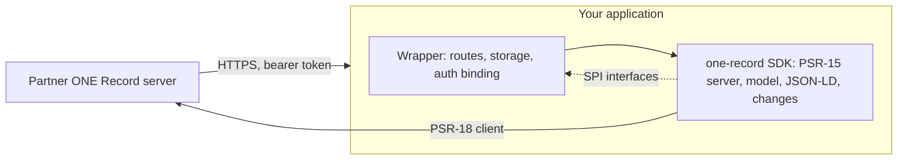

# ONE Record for PHP

`lambda-twelve/one-record` is a framework-agnostic PHP implementation of
[IATA ONE Record](https://iata-cargo.github.io/ONE-Record/): the **server**
side (a data holder publishing logistics objects to partners) and the
**client** side (talking to other parties' ONE Record servers), in one
Composer package with no framework dependency.

!!! warning "Under construction"
    The package is being built in the open. Nothing is released yet. The
    [roadmap](roadmap.md) shows what exists and what comes next.

## Who it is for

- **Freight forwarders, airlines, handlers and platforms** that need to publish
  or consume ONE Record data from a PHP system.
- **Framework integrators.** The package is designed to be wrapped: a Laravel
  wrapper (`lambda-twelve/one-record-laravel`) and a Drupal wrapper are planned.
  The [SDK boundary](sdk-boundary.md) page says exactly what the SDK owns and
  what a wrapper supplies.

## What it supports

| Specification | Versions |
| --- | --- |
| ONE Record API | 2.2.0 and 2.3.0, negotiated per request |
| ONE Record cargo ontology | 3.2 and 3.3 |
| ONE Record code lists | 1.1.0 |

See [API and data model versions](compatibility/versions.md) for how both
editions are served at once, and [Spec coverage](compatibility/spec-coverage.md)
for the endpoint-by-endpoint status.

## How it fits together

The SDK is a single PSR-15 request handler plus a client. Everything a host
must provide (storage, authentication, access policy, outgoing notifications)
is an interface with an in-memory reference implementation, so the whole thing
runs and is tested with no framework at all.
