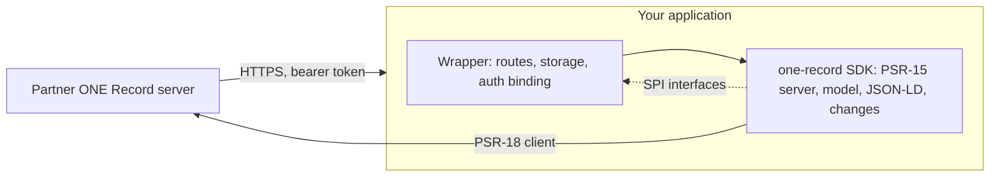

# ONE Record for PHP

`lambda-twelve/one-record` is a framework-agnostic PHP implementation of
[IATA ONE Record](https://iata-cargo.github.io/ONE-Record/): the **server**
side (a data holder publishing logistics objects to partners) and the
**client** side (talking to other parties' ONE Record servers), in one
Composer package with no framework dependency.

!!! info "Release status"
    In beta on [Packagist](https://packagist.org/packages/lambda-twelve/one-record):
    API 2.2.0 and 2.3.0 served and consumed, compliance and NE:ONE
    interoperability green, every release signed and tagged. Betas follow the
    review rounds of the Laravel and Drupal integrations and of independent
    adversarial reviews; public API changes are still allowed between betas
    and recorded in the [changelog](changelog.md). The [roadmap](roadmap.md)
    shows what is done and what comes next.

## Who it is for

- **Freight forwarders, airlines, handlers and platforms** that need to publish
  or consume ONE Record data from a PHP system.
- **Framework integrators.** The package is designed to be wrapped: a Laravel
  wrapper (`lambda-twelve/one-record-laravel`) and a Drupal wrapper are being
  built against it, and their first review round shaped the SPI. The
  [SDK boundary](sdk-boundary.md) page says exactly what the SDK owns and what
  a wrapper supplies; `Testing\Contract` ships the store contract tests a
  wrapper runs against its own implementations.

## What it supports

| Specification | Versions |
| --- | --- |
| ONE Record API | 2.2.0 and 2.3.0, negotiated per request |
| ONE Record cargo ontology | 3.2 and 3.3 |
| ONE Record code lists | 1.1.0 |

See [API and data model versions](compatibility/versions.md) for how both
editions are served at once, and [Spec coverage](compatibility/spec-coverage.md)
for the endpoint-by-endpoint status.

## How it fits together

The SDK is a single PSR-15 request handler plus a client. Everything a host
must provide (storage, authentication, access policy, outgoing notifications)
is an interface with an in-memory reference implementation, so the whole thing
runs and is tested with no framework at all.

## Quality signals

Every push runs the test suite on PHP 8.3, 8.4 and 8.5 with lowest and highest
dependencies, PHPStan at level max with the SDK-boundary and layer rules, the
code style check, the vocabulary regeneration check, the newman compliance
collection for API 2.2.0 and 2.3.0 against `bin/serve`, and this site's build;
pushes to `main` also run the [NE:ONE interoperability suite](compatibility/neone.md).
The [test coverage report](https://lambda-twelve.github.io/one-record/coverage/)
is published with the site on every change to `main`.
